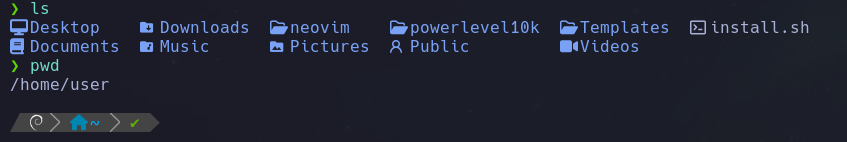
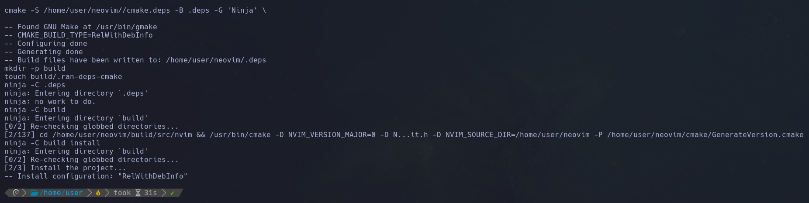
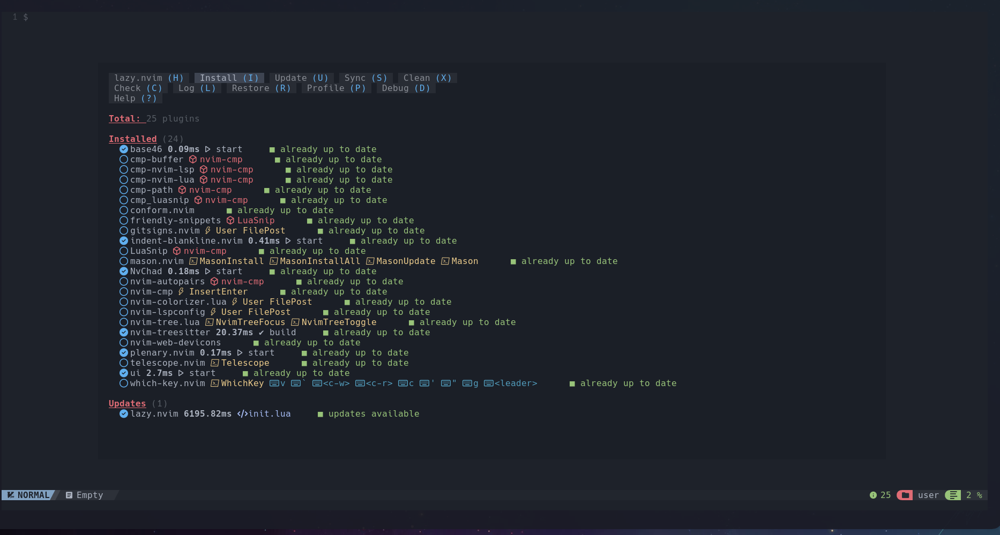
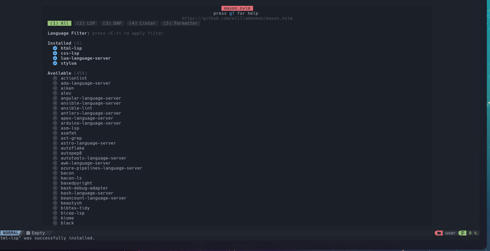
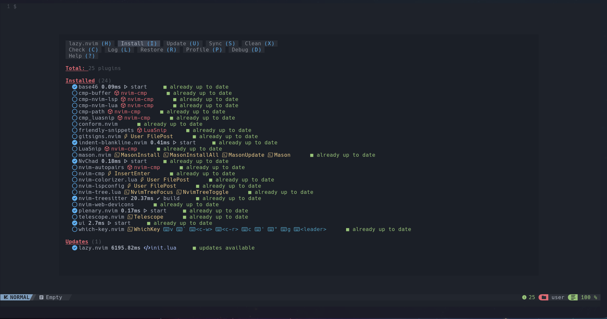

#Installing nvim AKA neovim in ARM64 Mac M1

1. Run this as user in any directory
   git clone https://github.com/NvChad/starter ~/.config/nvim

This will create a folder for nvim configuration in ~/.config/nvim

2. Install needed dependencies for neovim

sudo apt-get install ninja-build gettext cmake unzip curl build-essential

3. Run this as user in home/user

git clone https://github.com/neovim/neovim



4. Create a file with nano install.sh and paste following code:

   ```
   #!/bin/bash
   cd ./neovim || exit
   git checkout stable
   make distclean
   make CMAKE_BUILD_TYPE=RelWithDebInfo
   rm -rf /usr/local/share/nvim/runtime
   make install
   ```

   Save and exit nano

5. Add execution permision and Install as root

   ```
   sudo su
   chmod +x install.sh
   ./install.sh
   ```

   

6. Run nvim, this will install nvim
   ```
   nvim
   ```

This is when installed already:


7. In such screen run this to install with mason, if not possible close is with :qa and then run nvim again, this is how it looks when installations are done, those 4 are enough.

```
:MasonInstallAll
```



8. All the above was done in user now make the same for root

```
sudo su
cd
git clone https://github.com/NvChad/starter ~/.config/nvim && nvim
```



